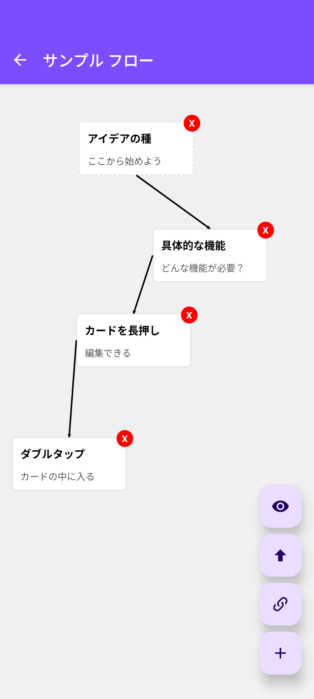
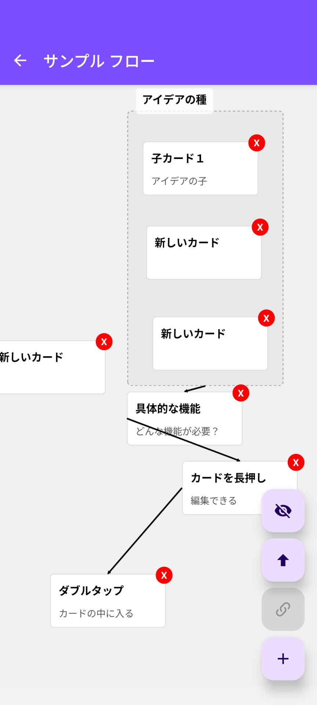

# FlowCards

カード単位で、項目を並べ、フローを設定して構成を表す。考えるための補助ツール


---

## 📖 概要 (Overview)

このアプリケーションは、構成を考えるための補助ツールアプリです。
ユーザーはカード単位で項目を並べることを通して、どのような構成が必要か考える時に役立つことを目指しています。
現時点では、ローカルで動き、ネットワークにつなげて情報を得るような機能は持っていません。
開発の背景には、自分のスマートホンで、このようなツールを利用したい思いがありました。

---

## ✨ 主な機能 (Features)

* **機能1**: フローの作成、更新、削除
* **機能2**: フローの中に、カードの追加、更新、削除
* **機能3**: カードをまとめて一つのカードにする（親カード）
* **機能4**: カードの内部で、子カードとしてフローを並べる
* **機能5**: カード同士を線で結びフローを表す
* **機能6**: カードを展開して内部がどういう構成か見る

---

## 📱 スクリーンショット (Screenshots)

|フローリスト|フローエディタ１|フローエディタ２|
|----|----|----|
|||

---

## 🛠️ 技術スタック (Tech Stack)

* **フレームワーク**: React Native
* **言語**: Javascript, Typescript
* **ナビゲーション**: React Navigation
* **データベース**: Sql-Lite
* **その他**: 開発にGemini Cli,/Github Copilotを利用

---

## 🚀 インストール・利用方法

**1. 前提条件 (Prerequisites)**
* Node.js (v22.17.0)
* Yarn
* etc..

**2. リポジトリをクローン**
```bash
git clone [https://github.com/koto2730/flowcards.git](https://github.com/koto2730/flowcards.git
cd flowcards
```

## 🙌 コントリビュート (Contributing)
このプロジェクトへのコントリビュートに興味を持っていただきありがとうございます！
Issueの起票やPull Requestの送付を歓迎します。

## 📜 ライセンス (License)
このプロジェクトはMITライセンスの下で公開されています。
詳細については LICENSE ファイルをご覧ください。

## 👤 作者 (Author)
koto2730

GitHub: [https://github.com/koto2730](https://github.com/koto2730)

X (Twitter): [@koto2730oss]