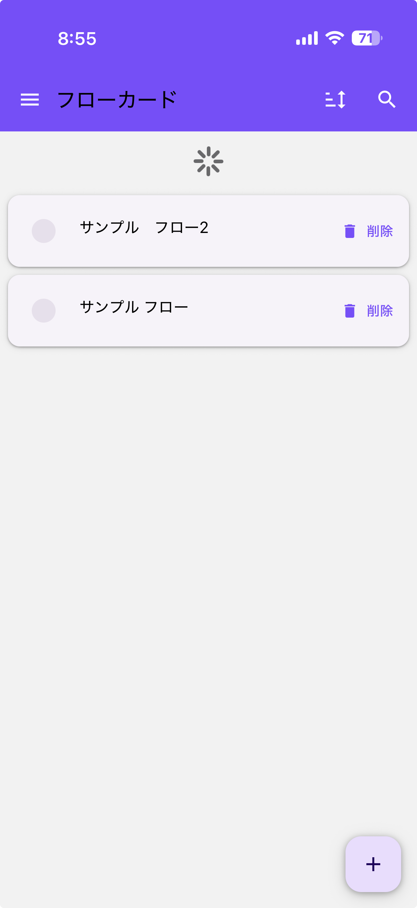
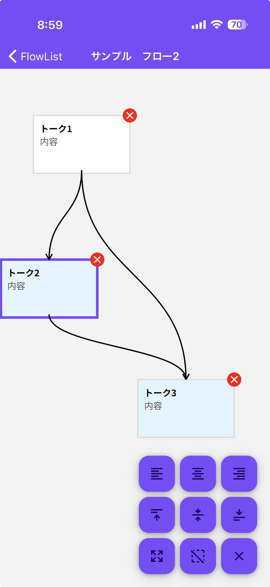
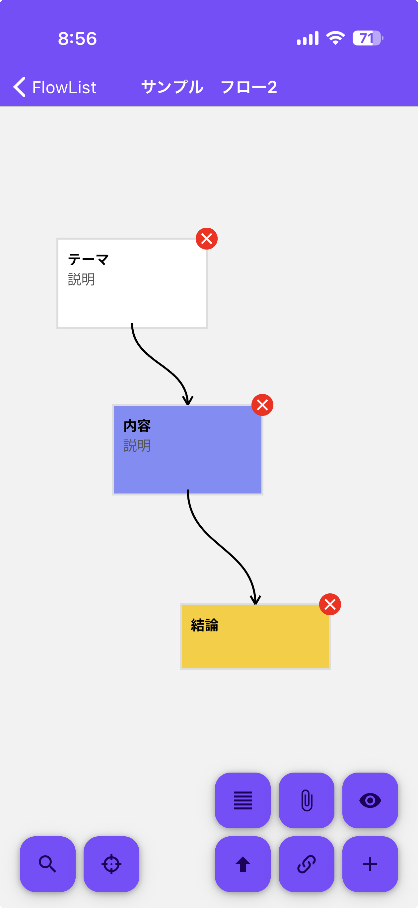
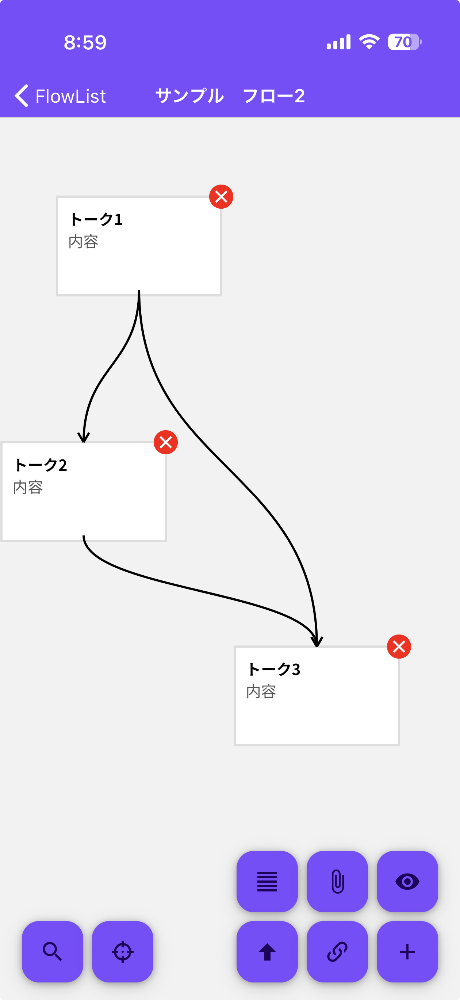
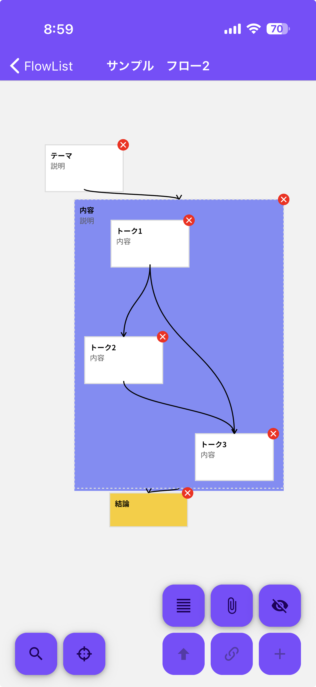
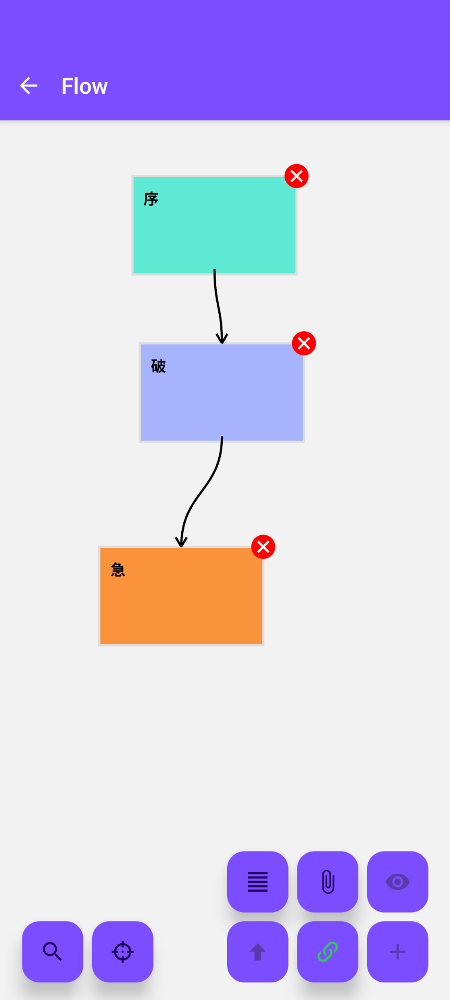
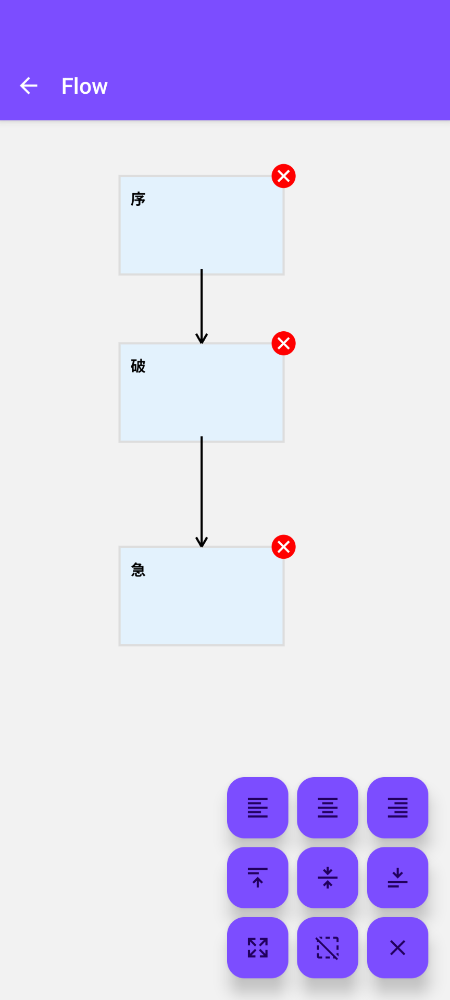
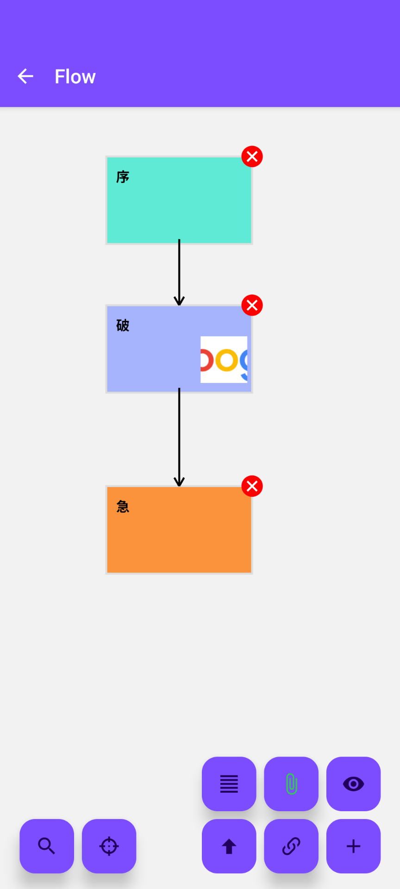

# FlowCards (v2.2.0)

[日本語 (Japanese)](./README-ja.md)

A support tool for thinking and structuring ideas by arranging items as cards and setting flows.


---

## 📖 Overview

This application is a support tool for structuring ideas.
Users can arrange items as cards to help visualize and organize what components are needed.
In addition to text, you can add attachments like files, URLs, and photos to cards for centralized information management.
Currently, it works locally and does not have features to connect to the network or fetch external information.
The motivation for development was the desire to use such a tool on my own smartphone.

---

## ✨ Features

* **Flow Management**: Create, update, and delete flows.
* **Card Operations**: Add, update, and delete cards within a flow.
* **Hierarchical Structuring**:
    * Group multiple cards into a single parent card.
    * Create nested flows with child cards inside a parent card.
    * Expand cards to see through their internal hierarchical structure.
* **Visual Connections**: Connect cards with lines to visualize relationships and flows.
* **Customization**:
    * Change card sizes between three levels (S/M/L).
    * Set a custom background color for each card.
* **Attachments**:
    * Attach files (images, PDFs, text, etc.) to cards.
    * Attach website URLs and display their previews.
* **Alignment Tools**: Select and align multiple cards (left, right, top, bottom, center) at once.
* **Export**: Export flow data in JSON format (.canvas).

---

## 📱 Screenshots

### iOS

|Flow List|Flow Editor|Card Editor|
|:---:|:---:|:---:|
||||

|Link Mode|See-Through Mode|Attachments|
|:---:|:---:|:---:|
||||

### Android

|Flow List|Flow Editor|Card Editor|
|:---:|:---:|:---:|
||||

|Link Mode|See-Through Mode|Attachments|
|:---:|:---:|:---:|
||||

---

## 🛠️ Tech Stack

* **Framework**: React Native
* **Language**: JavaScript
* **UI Libraries**:
    * React Native Paper
    * React-Native-Skia (for drawing)
    * React-Native-Reanimated (for animations)
* **State Management**: React Hooks (useState, useMemo, etc.)
* **Navigation**: React Navigation
* **Database**: react-native-sqlite-storage
* **File Management**:
    * react-native-fs
    * @react-native-documents/picker
* **Others**: Developed using Gemini CLI and GitHub Copilot

---

## 🚀 Installation & Usage

**1. Prerequisites**
* Node.js (v22.17.0)
* Yarn
* etc.

**2. Clone the repository**
```bash
git clone https://github.com/koto2730/flowcards.git
cd flowcards
```

---

## 🙌 Contributing

Thank you for your interest in contributing to this project!
Issues and Pull Requests are welcome.

---

## 📜 License

This project is released under the MIT License.
See the LICENSE file for details.

---

## 👤 Author

koto2730

GitHub: [https://github.com/koto2730](https://github.com/koto2730)

X (Twitter): [@koto2730oss]
