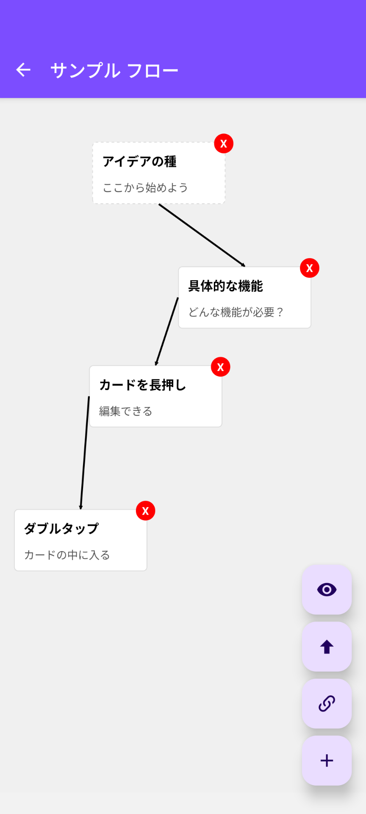

# FlowCards

[日本語 (Japanese)](./README-ja.md)

A support tool for thinking and structuring ideas by arranging items as cards and setting flows.


---

## 📖 Overview

This application is a support tool for structuring ideas.  
Users can arrange items as cards to help visualize and organize what components are needed.  
Currently, it works locally and does not have features to connect to the network or fetch external information.  
The motivation for development was the desire to use such a tool on my own smartphone.

---

## 🐞 Known Issues

- The position where links are drawn can sometimes be unnatural.
- On iOS builds, when cards overlap, the global Pan event may occur and prevent events from reaching the cards (therefore, not published on the App Store).

---

## ✨ Features

* **Feature 1**: Create, update, and delete flows
* **Feature 2**: Add, update, and delete cards within a flow
* **Feature 3**: Group cards into a parent card
* **Feature 4**: Arrange child cards as flows inside a card
* **Feature 5**: Connect cards with lines to represent flows
* **Feature 6**: Expand cards to see their internal structure

---

## 🛠 Planned Features

### Flow List Screen
- Grouping and tagging flows for easier search when the number of flows increases

### Flow Editor Screen
- Adjust initial display position (e.g., open at the last viewed position)
- Implement alignment mode to gather and arrange distant cards within the display area
- Zoom in/out functionality
- Export feature for compatibility with Obsidian canvas files, etc.
- Provide alternative data saving methods
- Allow coloring of cards
- Enable resizing of cards
- Add detailed content to cards
- Set media files and links in card details
- Make link lines flexible (not just straight lines)
- Add more link types (forward, backward, both)
- Redraw link lines when cards are dragged

---

## 📱 Screenshots

|List|Editor|Editor|
|----|----|----|
|||

---

## 🛠️ Tech Stack

* **Framework**: React Native
* **Languages**: Javascript, Typescript
* **Navigation**: React Navigation
* **Database**: SQLite
* **Others**: Developed using Gemini CLI and GitHub Copilot

---

## 🚀 Installation & Usage

**1. Prerequisites**
* Node.js (v22.17.0)
* Yarn
* etc.

**2. Clone the repository**
```bash
git clone https://github.com/koto2730/flowcards.git
cd flowcards
```

---

## 🙌 Contributing

Thank you for your interest in contributing to this project!  
Issues and Pull Requests are welcome.

---

## 📜 License

This project is released under the MIT License.  
See the LICENSE file for details.

---

## 👤 Author

koto2730

GitHub: [https://github.com/koto2730](https://github.com/koto2730)

X (Twitter): [@koto2730oss]

---

## 🇯🇵 Japan
